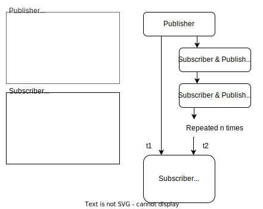

# pubsub-benchmark
Baseline performance metrics for various on-device publisher-subscriber implementations, with a focus on mobile (single board computer) use.

## Variables

+ Frameworks
   + [Python Multiprocessing Queue](https://docs.python.org/3/library/multiprocessing.html?highlight=multiprocessing%20queue#multiprocessing.Queue)
   + [Python Multithreading Queue](https://docs.python.org/3/library/queue.html)
   + [ROS2](https://docs.ros.org/)
   + [commaai/cereal](https://github.com/commaai/cereal): "cereal is both a messaging spec for robotics systems as well as generic high performance IPC pub sub messaging"
+ Message Size
   + Small: Single `char`
   + Medium: Dictionary of a handful of scalars/floats
   + Large: RGB image
+ Device
  + Desktop (Ubuntu 20.04)
  + NVIDIA Jetson Xavier NX (Ubuntu 18.04)
  + NVIDIA Jetson Nano (Ubuntu 18.04)
  
## Benchmarking Strategy

  
## Feature Limitations

**commaai/cereal** has the fewest features, so we use its "one publisher, multiple subscriber" as the lowest common denominator basis for benchmarking.

